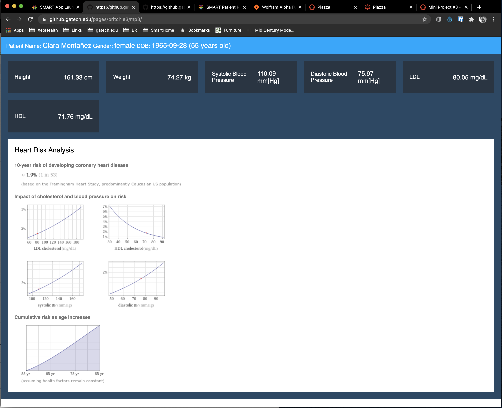

# Integration of SMART on FHIR with a Computable Knowledge Base

Developed as part of Georgia Tech Master's Program for CS-6440 - Introduction to Healthcare Informatics.  The FHIR framework template was provided as part of this course.

## Overview

Computable knowledge bases provide not only static information but also a mechanism to perform dynamic calcula-tions based on collections of data and algorithms.  By leveraging the data from SMART on FHIR connectivity, the knowledge base can be leveraged to provide easy access to additional healthcare insight.

SMART on FHIR provides secure access to a wide range of raw data within a healthcare provider’s system. By providing access, it opens the ability for aug-menting healthcare processes with analysis from external sources such as knowledge bases.  A unique form of knowledge base is the “Computable knowledge Base” such as one Wolfram known as Wolfram | Alpha.

“The introduction of Wolfram|Alpha defined a fundamentally new paradigm for getting knowledge and answers—not by searching the web, but by doing dynamic computations based on a vast collection of built-in data, algorithms and methods. Bringing broad, deep, expert-level knowledge to everyone… anytime, anywhere.” - https://www.wolframalpha.com/about

Integrating SMART on FHIR with a computable knowledge base would facilitate seamless access to not other static information but also collections of data and algorithms.

## Architecture

Once the SMART application finishes authentication, it pulls the required data from the healthcare system using Javascript in the browser to call the necessary FHIR APIs.  This part of the solution is based on code developed for Lab 3-2.  Once the data is collected, the Javascript calls a REST API gateway to the Wolf-ram | Alpha system.  

A REST API gateway was built to facilitate Cross-origin Resource Sharing (CORS) security requirements.   The Wolfram API does not support CORS and therefore cannot be called directly from a web browser through Javascript.  The REST API gateway is built using C# running on ASP.NET Core 3.1 in Azure.  It provides the appropriate CORS headers, formats data for the Wolfram API and relays the results back to the browser.

Once the Javascript receives the JSON results from the API, it loops through them dynamically pulling out the “PODS” which are different categories of re-sults.  Each POD contains a title as well as data for display.  This information is used to update the API with the results of the analysis.

## Sample Screen Shot

## Video Demonstration

A screen recording of the application can be viewed here:
https://www.youtube.com/watch?v=H8zZ0Z-BomA

## Development Notes

Dependencies for API:
* A developer key from Wolfram | Alpha:  https://developer.wolframalpha.com/portal/myapps/
  * Add to appsettings.json 
* Run API locally or deploy API to Azure, AWS, or other cloud provider